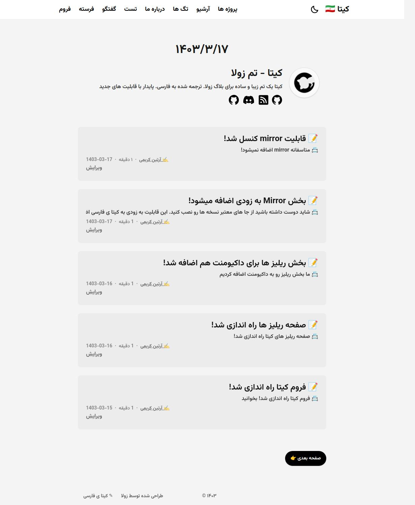

# Kita

Kita is a clean, elegant and simple blog theme for Zola. Translated to persian

This theme is based on Hugo theme [hugo-paper](https://github.com/nanxiaobei/hugo-paper) with some features added.

[Demo](https://thecode764.github.io/kita/)




## Features

- Easy to use and modify
- No preset limits (This theme does not limit your content directory structure, taxonomy names, etc. It's applicable to all zola sites.)
- Dark mode
- Responsive design
- Social icons
- Taxonomies support
- Projects page
- Archive page
- Table of Content
- Admonition shortcode
- SEO friendly
- Comments using [Giscus](https://giscus.app/)
- Mathematical notations using [KaTeX](https://katex.org/)
- Diagrams and charts using [Mermaid](https://mermaid.js.org/)

## Installation

The easiest way to install this theme is to clone this repository in the themes directory:

```sh
git clone https://github.com/Thecode764/kita themes/kita
```

Or to use it as a submodule:

```sh
git submodule add https://github.com/Thecode764/kita.git themes/kita
```

Then set `kita` as your theme in `config.toml`.

```toml
theme = "kita"
```

## Configuration

See the `extra` section in [config.toml](https://github.com/Thecode764/kita/blob/main/config.toml) as a example.

## License

[MIT License](https://github.com/Thecode764/kita/blob/main/LICENSE)

Copyright (c) 2023-present, st1020

## Official website


## Docs 
The official docs is https://thecode764.github.io/kita-docs


## Badges


[](https://results.pre-commit.ci/latest/github/Thecode764/kita/main)

## Notes
> [!NOTE]  
> Please verify you blog with this link https://thecode764.github.io/Kita-website comment it you blog url

## Have question Ask it!

[Forum](https://persian-kita.discourse.group/)
## Important
> [!IMPORTANT]  
> If you website blog is not working check status https://thecode764.github.io/kita/status
## Contributors

<!-- ALL-CONTRIBUTORS-LIST:START - Do not remove or modify this section -->
<!-- prettier-ignore-start -->
<!-- markdownlint-disable -->

<!-- markdownlint-restore -->
<!-- prettier-ignore-end -->

<!-- ALL-CONTRIBUTORS-LIST:END -->
